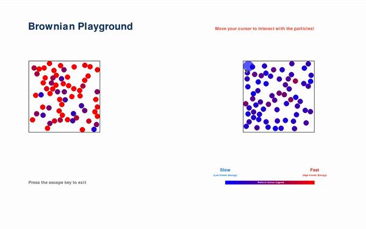

<h1 align="center">Play Particle</h1>



## Project description

[](https://drive.google.com/file/d/1FKOxowEhPYDgKZGy9jB6IOgJotQ1MKr9/view?usp=sharing)
[](https://drive.google.com/file/d/1zta9afFmtgDWi_BGRvd_Ro_f0VnNYJmS/view?usp=sharing)

Play Particle demonstrates an interactive 2D particle simulation using the Pygame library based on the kinetic-molecular theory. The particles can move and interact with each other, exhibiting behaviors such as bouncing off boundaries and colliding with one another. The user can observe and interact with the simulation by moving the draggable particle and witnessing the resulting effects on the system.

### Contributors
1. Alysha Maulidina - Documentation
2. [Kimberly Mazel](https://github.com/kimberlymazel) - Code development

## Features
1. Interactive: use your mouse and keyboard to see the particles move and interact with one another
2. Change states of matter: Adjust the temperature slider and to change the state of the particles within the simulation
3. Chamber pressure: Adjust the pressure setting by dragging the lid on the chamber, and the simulation reflects the corresponding changes in particle movement and collisions.
4. Color mapping: Color mapping provides an intuitive representation of the relationship between particle speed and temperature, as described by the kinetic-molecular theory.

## Controls
1. `SPACE BAR` to merge the two containers
2. `ESC` to go back a page
3. `Exit` to exit the application

## Getting started
1. Clone this repo.
```bash
git clone https://github.com/alyshapm/play-particle
```
2. Install the dependencies
```bash
pip inatall pygame numpy sys
```
2. Run and happy experimenting!

## Acknowledgements

This project was inspired by franconepippone's [project](https://github.com/franconepippone/simple-gas-sim) and references certain parts of the code.
